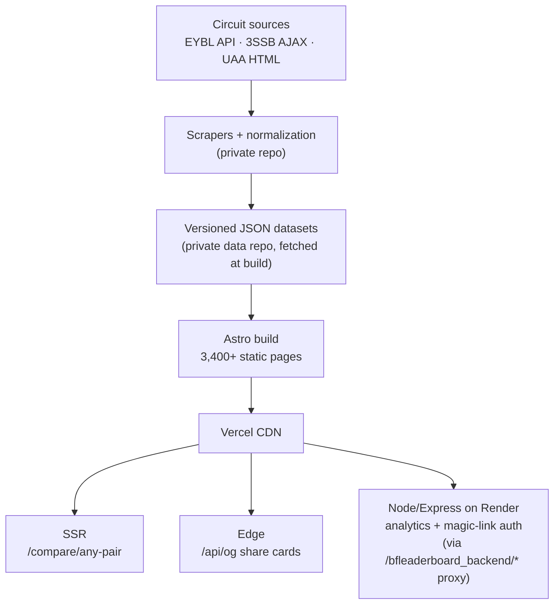

# Circuit Stats

**Live at [circuitstats.com](https://circuitstats.com)** — national stats and rankings for AAU youth basketball, covering **2,945 players** across the three biggest U.S. circuits (Nike EYBL, Under Armour UAA, adidas 3SSB) at U15/U16/U17. This data does not exist anywhere else in a combined, searchable, rankable form.

Built and operated solo: scrapers → normalized dataset → product → SEO → analytics.

## What it does

- **Leaderboards** — rank any age group in any circuit by any stat
- **Player pages** — full stat lines with national and circuit-level rankings (3,357 programmatically generated pages)
- **Compare** — any two players side by side, any circuit, any age group (server-rendered on demand for arbitrary pairs)
- **Team pages** — rosters with per-player production, standings

Used by AAU coaches scouting opponents, college recruiters shortlisting without traveling, and parents checking where their kid really ranks.

## Architecture



- **Static-first:** every player, team, and leaderboard page is prebuilt at deploy time — fast, cheap, and fully indexable.
- **SSR where static can't go:** `/compare/[slug]` renders any of ~5.6M possible player pairs on demand; curated pairs are prebuilt.
- **Edge OG cards:** share a player link in iMessage/Slack and get a branded stat card PNG generated at the edge.
- **Backend proxy:** `vercel.json` routes `/bfleaderboard_backend/*` to a Node/Express backend on Render for visit analytics and dashboard auth — one origin, no CORS.

## Programmatic SEO

- Clean canonical URLs (`/player/kellen-paul-uaa-u15` — no trailing slash, no `.html`)
- Generated `sitemap.xml` over the full slug catalog
- **URL-parity audit** (`audit_urls.py`): before any cutover, every legacy URL is crawled against the new deploy — the release gate is `0 broken`
- Blue-green cutover runbook in [DEPLOY.md](DEPLOY.md): stand up on a fresh Vercel project, verify, move the domain, instant rollback path

## Data notes

Stats are official per-circuit box scores, scraped per source (EYBL via its API, 3SSB via Playwright + AJAX capture, UAA via HTML), normalized into one schema. 3SSB does not publish shooting attempts (only percentages), so derived metrics degrade gracefully per circuit. The scraping pipeline and the datasets themselves live in separate private repos — this repo is the full site code; `scripts/fetch-data.mjs` pulls the data at build time.

## Stack

Astro · TypeScript · Vercel (static + SSR + edge) · Node/Express + MongoDB (Render) · Python (audit tooling) · Playwright (data acquisition)

## Run locally

```sh
npm install
npm run dev
```

The stats datasets are not in this repo — the build fetches them from a private data repo (`DATA_REPO_TOKEN` required). Site code is fully browsable here; the data powering [circuitstats.com](https://circuitstats.com) stays private.
